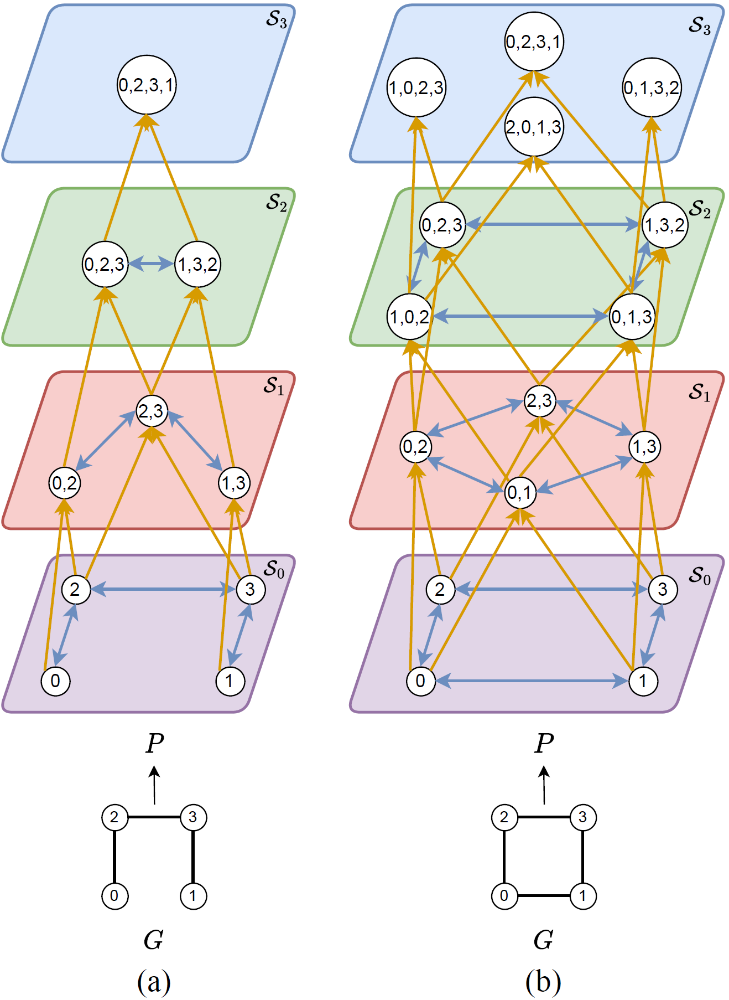

# Path Complex Networks

<a href="https://github.com/quang-truong/Path-Complex-Networks"></a>
[](https://arxiv.org/abs/2308.06838)


This is the official repository for the paper **"Weisfeiler and Lehmann Go Paths: Learning Topological Features via Path Complexes."** Our work largely bases on the [original repo](https://github.com/twitter-research/cwn) by Bodnar et. al. for [MPSN](https://arxiv.org/abs/2103.03212) and [CWN](https://arxiv.org/abs/2106.12575).

<p align="center">
    
</p>

## Abstract

*Graph Neural Networks (GNNs), despite achieving remarkable performance across different tasks, are theoretically bounded by the 1-Weisfeiler-Lehman test, resulting in limitations in terms of graph expressivity. Even though prior works on topological higher-order GNNs overcome that boundary, these models often depend on assumptions about sub-structures of graphs. Specifically, topological GNNs leverage the prevalence of cliques, cycles, and rings to enhance the message-passing procedure. Our study presents a novel perspective by focusing on simple paths within graphs during the topological message-passing process, thus liberating the model from restrictive inductive biases. We prove that by lifting graphs to path complexes, our model can generalize the existing works on topology while inheriting several theoretical results on simplicial complexes and regular cell complexes. Without making prior assumptions about graph sub-structures, our method outperforms earlier works in other topological domains and achieves state-of-the-art results on various benchmarks.*

## Package Installation

This project uses `Python 3.8.15`, `Pytorch 1.12.1`, and `Pytorch Geometric 2.2.0` on `CUDA 11.6`. Please create a new environment with `Python 3.8.15`.

```markdown
conda create --name pcn python=3.8.15
conda activate pcn
conda install pip
```

Then follow the below steps.

```markdown
sh graph-tools_install.sh
conda install pytorch==1.12.1 torchvision==0.13.1 torchaudio==0.12.1 cudatoolkit=11.6 -c pytorch -c conda-forge
sh pyg_install.sh cu116
pip install -r requirements.txt
```

## WandB

Our repository uses [WandB](https://wandb.ai/) to keep track of research experiments and hyperparameter tuning. Please follow the instruction on WandB official website to register and sign in via WandB CLI. Our codes automatically update research results to your WandB server.

## Experiments

Navigate to the repository's root directory. Every experiment's shell script is included in `experiments/scripts`. In order to execute an experiment, just simply enter `sh experiments/scripts/pcn_<experiment>.sh`. For ZINC, MOLHIV, graph datasets will be automatically downloaded. For SR-GRAPHS, the dataset is already included in this repository. For TUDatasets, we need to perform the following steps:

1. Download raw dataset from [here](https://www.dropbox.com/s/2ekun30wxyxpcr7/datasets.zip?dl=0).
2. Place the downloaded archive in the root directory and unzip the archive.
3. Execute the corresponding shell script as usual.

### Credits

Please cite our paper  if you find our work is useful for your research.

```markdown
@misc{truong2023weisfeiler,
  title={Weisfeiler and Lehman Go Paths: Learning Topological Features via Path Complexes}, 
  author={Quang Truong and Peter Chin},
  year={2023},
  eprint={2308.06838},
  archivePrefix={arXiv},
  primaryClass={cs.LG}
}
```

Also, please cite these precedent papers which are the cornerstones for our work.

```markdown
@inproceedings{pmlr-v139-bodnar21a,
  title = {Weisfeiler and {Lehman} Go Topological: Message Passing Simplicial Networks},
  author = {Bodnar, Cristian and Frasca, Fabrizio and Wang, Yuguang and Otter, Nina and Montufar, Guido F and Li{\'o}, Pietro and Bronstein, Michael},
  booktitle = {Proceedings of the 38th International Conference on Machine Learning},
  pages = {1026--1037},
  year = {2021},
  editor = {Meila, Marina and Zhang, Tong},
  volume = {139},
  series = {Proceedings of Machine Learning Research},
  month = {18--24 Jul},
  publisher = {PMLR},
}
```

```markdown
@inproceedings{neurips-bodnar2021b,
  title = {Weisfeiler and {Lehman} Go Cellular: {CW} Networks},
  author = {Bodnar, Cristian and Frasca, Fabrizio and Otter, Nina and Wang, Yuguang and Li\`{o}, Pietro and Montufar, Guido F and Bronstein, Michael},
  booktitle = {Advances in Neural Information Processing Systems},
  editor = {M. Ranzato and A. Beygelzimer and Y. Dauphin and P.S. Liang and J. Wortman Vaughan},
  pages = {2625--2640},
  publisher = {Curran Associates, Inc.},
  volume = {34},
  year = {2021}
}
```
